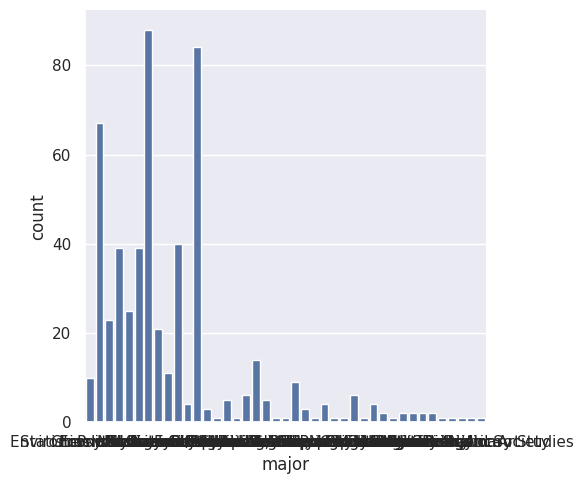
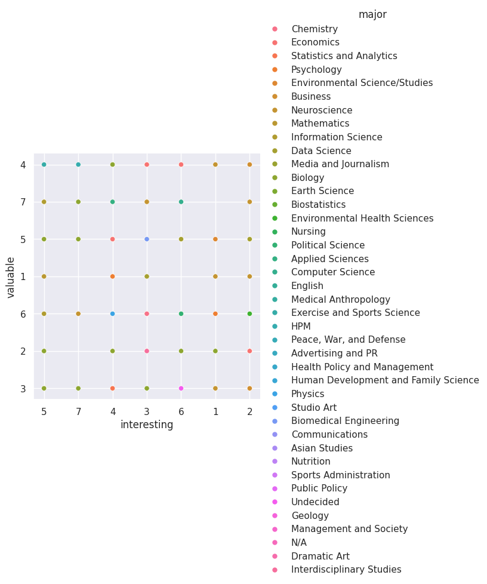
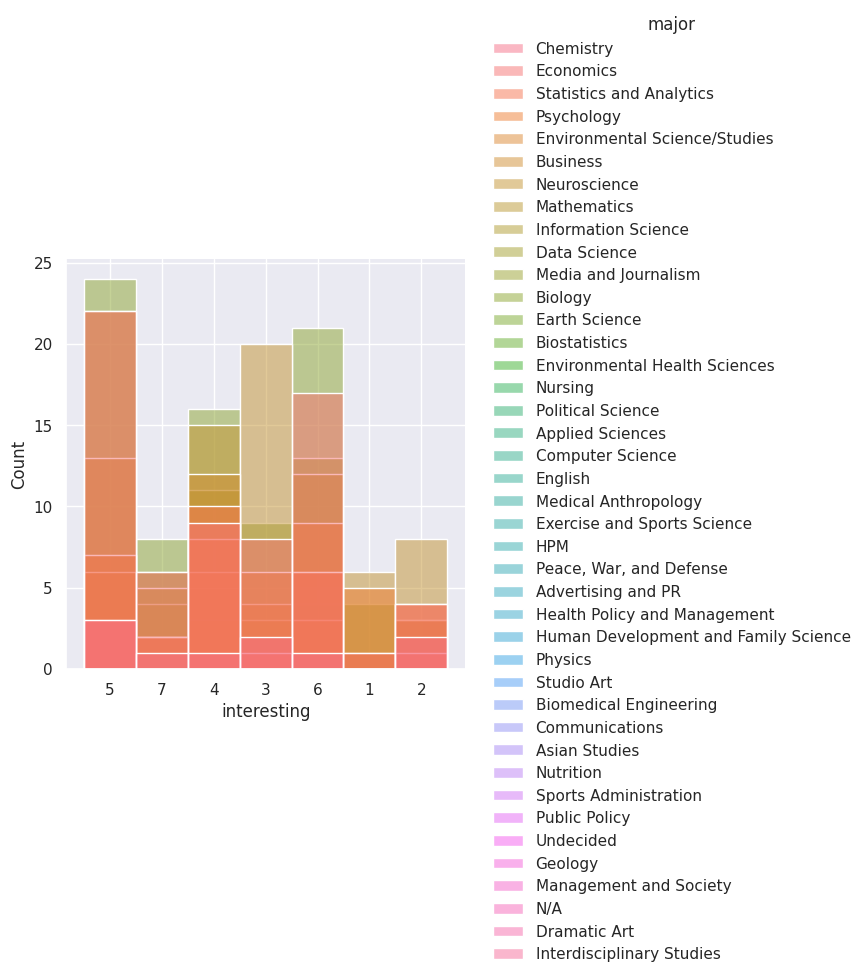

---
# Do not edit the text between these lines!
layout: default
---

# EX09: Data Analysis for Continuous Improvement

<!-- This is a comment. Below, you'll see code for inserting an image. To make this image appear, update <custom-path>. To add an image, save it inside the imgs folder of this repository. -->

## Summary Analysis

To analyze this idea, we examined survey data from COMP110 students to understand how students from different majors experience the course. We used functions like read_csv_rows, columnar, head, select, and count to organize and explore the data. We focused specifically on the columns for major, interesting, valuable, understanding, and would recommend.

First, we looked at the distribution of majors to confirm that the course includes a wide range of students beyond computer science. Then, we created visualizations to explore how students from different majors rated the course's interest and value. We also analyzed how these ratings relate to each other to better understand patterns in student engagement.

The visualizations helped reveal trends in how different groups of students perceive the course material and whether engagement varies depending on academic background.

## Visualizations 

This bar chart shows the number of students in each major, highlighting the diversity of academic backgrounds in the course.

This scatterplot compares how interesting students found the course versus how valuable they found it, grouped by major. It helps show whether students who find the course more interesting also see it as more valuable.

This histogram shows the distribution of how interesting students found the course, broken down by major. It helps identify whether some majors find the course less engaging than others.

## Conclusions

Overall, the analysis provides moderate support for the idea that incorporating more real-world, interdisciplinary datasets could improve student engagement and perceived value of the course.

The data shows that students come from a wide variety of majors, meaning the course serves a diverse audience. The relationship between how interesting and valuable students find the course suggests that engagement plays a key role in how useful students perceive the material to be. However, the variation across majors indicates that not all students experience the course in the same way.

This supports the idea that adding interdisciplinary datasets could help make the material more relevant, especially for students outside of computer science.

There are some potential downsides to this idea. Adding interdisciplinary datasets could make the course more complex to design and teach. It may also take time away from core programming concepts. Additionally, not all students may benefit equally from these changes, especially those already interested in computer science.

In the future, more data could be collected to better support this idea. For example, students could be asked directly whether course examples feel relevant to their major, and what types of datasets they would find most engaging. Further analysis could also group majors into broader categories (such as STEM vs. non-STEM) to better identify trends. Testing this idea in a future semester would provide stronger evidence of its impact.
